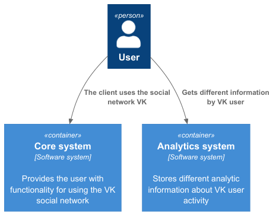
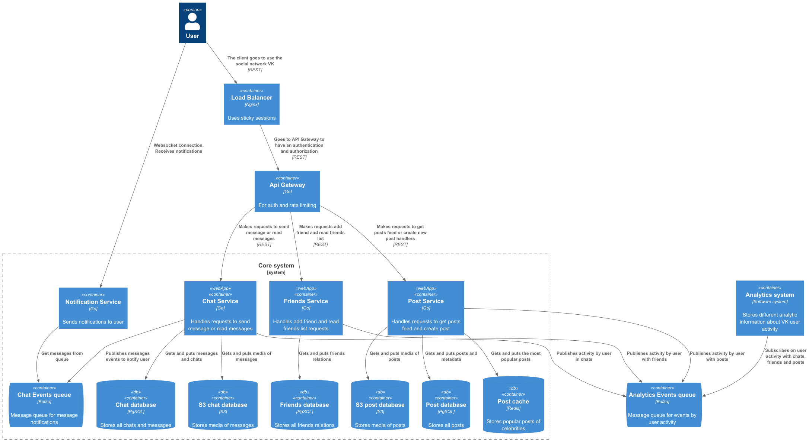
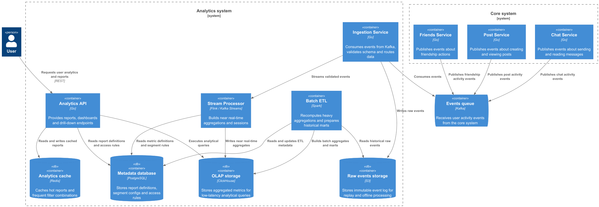

# System Design социальной сети

## Функциональные требования

* Добавление и удаление друзей
* Просмотр друзей пользователя
* Просмотр анкеты пользователя
* Публикация поста в ленту
* Загрузка медиа файлов для постов
* Просмотр ленты постов (домашней и пользователей)
* Просмотр диалогов и чатов пользователя
* Отправка и чтение сообщений в диалогах и чатах

---

## Нефункциональные требования

* **DAU**: 47 000 000
* Каждый пользователь в среднем отправляет **10 сообщений в день**
* Каждый пользователь в среднем просматривает сообщения **20 раз в день**
* **Availability**: 99.95%
* Максимальное количество символов в сообщениях: **4096**
* Размер одного символа: **2 байта**

  * (UTF-8: обычно 2 байта, но эмодзи и иероглифы могут занимать 4–8 байт)
* Максимальное количество символов в постах: **16384**
* Максимальный размер изображения в постах: **1 МБ**
* Максимальное количество изображений в постах: **5**
* Геораспределенность: **СНГ**
* Сезонность: **отсутствует**

---
## Нефункциональные требования

Для проектирования системы я использовал [модель C4](https://c4model.com/). Модель C4 была создана для того, чтобы помочь командам разработчиков описывать архитектуру программного обеспечения и обмениваться информацией о ней — как на этапе предварительного проектирования, так и при ретроспективном документировании уже существующей кодовой базы. По сути, это способ создания «карт» вашего кода с различной степенью детализации — подобно тому, как вы используете, например, Google Maps, чтобы приближать или отдалять интересующую вас область.

**Уровень 1.** Диаграмма контекста системы



**Уровень 2.** Диаграмма контейнеров core системы



**Уровень 2.** Диаграмма контейнеров аналитической системы


## Вычисления

### RPS сообщений

* **Write (отправка сообщений)**:

  ```
  47 000 000 * 10 / 24 / 60 / 60 = 5440 req/s
  ```

* **Read (чтение сообщений)**:

  ```
  47 000 000 * 20 / 24 / 60 / 60 = 10880 req/s
  ```

---

### Размер БД для сообщений

* **Трафик на запись сообщений**:

  ```
  5440 * 4096 * 2 ≈ 42.5 MB/s
  ≈ 3586 GB/day
  ≈ 1280 TB/year
  ```

* **Фактор репликации**: 3

* **Размер БД на 5 лет**:

  ```
  1280 * 3 * 5 ≈ 20 PB
  ```

---

## Посты

### RPS постов

* Каждый пользователь создает **1 пост в день**

* Каждый пользователь читает **20 постов в день**

* **Write (создание постов)**:

  ```
  47 000 000 * 1 / 24 / 60 / 60 = 544 req/s
  ```

* **Read (чтение постов)**:

  ```
  47 000 000 * 20 / 24 / 60 / 60 = 10880 req/s
  ```

---

### Текст постов

* **Трафик на запись**:

  ```
  544 * 16384 * 2 ≈ 17 MB/s
  ≈ 1435 GB/day
  ≈ 512 TB/year
  ```

* **Фактор репликации**: 3

* **Размер БД на 5 лет**:

  ```
  512 * 3 * 5 ≈ 8 PB
  ```

---

### Картинки

* **Трафик на запись**:

  ```
  544 * 5 * 1 048 576 ≈ 2720 MB/s
  ≈ 225 TB/day
  ≈ 80 PB/year
  ```

* **Фактор репликации**: 3

* **Размер хранилища на 5 лет**:

  ```
  80 * 3 * 5 ≈ 1200 PB
  ```

---

## Количество дисков (на 5 лет)

### Сообщения

* HDD: **8 TB**

* **Количество дисков**:

  ```
  20 PB / 8 TB = 2560 дисков
  ```

---

### Посты с картинками

#### Холодные данные (HDD — 60%)

* HDD: **8 TB**

* **Количество дисков**:

  ```
  (1200 PB + 8 PB) * 0.6 / 8 TB = 92775 дисков
  ```

---

#### Горячие данные (SSD — 40%)

* SSD: **8 TB**

* **Количество дисков**:

  ```
  (1200 PB + 8 PB) * 0.4 / 8 TB = 61850 дисков
  ```
